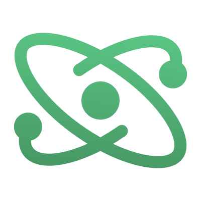

<p align="center">
  <p align="center">
    
  </p>
  <h1 align="center"><b>React Reflex</b></h1>
  <p align="center">
    An all-in-one state container.
    <br />
    <a href="https://npmjs.com/package/@rbxts/react-reflex"><strong>npm package →</strong></a>
  </p>
</p>

<div align="center">


[](https://www.npmjs.com/package/@rbxts/react-reflex)
[](LICENSE.md)

</div>

**Reflex** is a simple state container inspired by [Rodux](https://github.com/roblox/rodux) and [Silo](https://github.com/sleitnick/rbxts-silo), designed to be an all-in-one solution for managing and reacting to state in Roblox games.

**React Reflex** provides React hooks and components for Reflex using either [`@rbxts/react`](https://github.com/littensy/rbxts-react) or [`jsdotlua/react`](https://github.com/jsdotlua/react-lua).

See the [React Reflex documentation](https://littensy.github.io/reflex/docs/guides/roact-reflex/) for more information.

## 📦 Setup

### TypeScript

Install the `@rbxts/react-reflex` package using your package manager of choice.

```sh
npm install @rbxts/react-reflex
yarn add @rbxts/react-reflex
pnpm add @rbxts/react-reflex
```

### Wally

Add `littensy/react-reflex` to your `wally.toml` file.

```toml
[dependencies]
ReactReflex = "littensy/react-reflex@VERSION"
```

## 🚀 Examples

### Mounting your app

Use `<ReflexProvider>` to enable Reflex hooks and components:

```tsx
import React, { StrictMode } from "@rbxts/react";
import { createPortal, createRoot } from "@rbxts/react-roblox";
import { ReflexProvider } from "@rbxts/react-reflex";

const root = createRoot(new Instance("Folder"));

root.render(
	<StrictMode>
		<ReflexProvider producer={producer}>
			{/* Your app */}
			{createPortal(<App />, playerGui)}
		</ReflexProvider>
	</StrictMode>,
);
```

### Typed hooks

Custom hooks can be created to provide typed hooks for your state:

```tsx
import { useProducer, useSelector, UseProducerHook, UseSelectorHook } from "@rbxts/react-reflex";

export const useRootProducer: UseProducerHook<RootProducer> = useProducer;
export const useRootSelector: UseSelectorHook<RootProducer> = useSelector;
```

### Counter

```tsx
import React from "@rbxts/react";
import { useRootProducer, useRootSelector } from "./hooks";

export function Counter() {
	const producer = useRootProducer();
	const count = useRootSelector((state) => state.count);

	return (
		<textbutton
			Text={`Count: ${count}`}
			AnchorPoint={new Vector2(0.5, 0.5)}
			Size={new UDim2(0, 100, 0, 50)}
			Position={new UDim2(0.5, 0, 0.5, 0)}
			Event={{
				Activated: () => producer.increment(),
				MouseButton2Click: () => producer.decrement(),
			}}
		/>
	);
}
```

## 📚 Resources

- [Reflex Documentation](https://littensy.github.io/reflex/) - Learn about Reflex's core concepts and API
- [Reflex Repository](https://github.com/littensy/reflex) - The official Reflex repository
- [React Lua Documentation](https://jsdotlua.github.io/react-lua/) - A comprehensive guide for the differences between Roact and React

## 📝 License

This project is licensed under the [MIT license](LICENSE).
